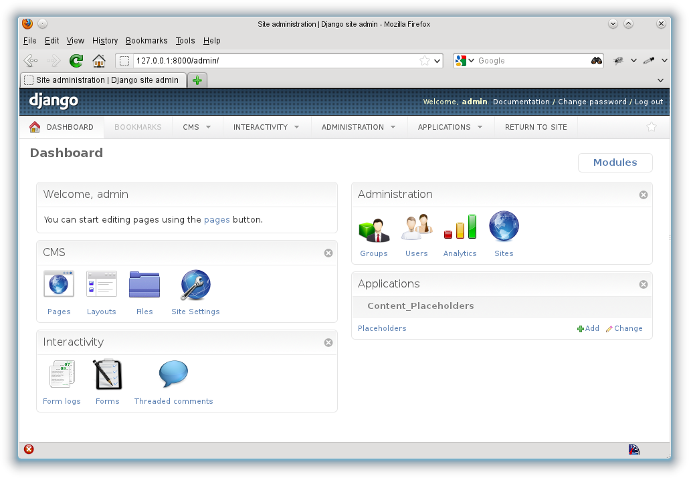

Welcome to django-fluent-dashboard's documentation!
===================================================

The ``fluent_dashboard`` module offers a custom admin dashboard, built on top of
django-admin-tools_ (`code <https://bitbucket.org/izi/django-admin-tools/wiki/Home>`_).

The django-admin-tools_ package provides a default mechanism to replace the standard Django
admin homepage with a widget based dashboard. The ``fluent_dashboard`` module extends this,
by providing additional widgets (called "modules") such as:

* a "icon list" module for the admin homepage.
* a "welcome" module for the admin homepage.
* a configurable module layout for the admin homepage, through ``settings.py``.
* a "return to site" link.

Contents:

.. toctree::
   :maxdepth: 2

   installation
   configuration
   optionaldeps
   advanced
   otherapps
   api/index

Preview
=======

Icon credits
============

By default, the dashboard uses the "Oxygen" icon theme, which is freely available from KDE.
You may use the icons under the `LGPL 3 license <http://www.gnu.org/licenses/lgpl-3.0.html>`_.
To use a different icon theme (e.g. `Tango <http://tango.freedesktop.org/>`_),
see the :ref:`FLUENT_DASHBOARD_ICON_THEME` setting in the :ref:`configuration` section.

For more information about the Oxygen icon theme, see:

* http://www.oxygen-icons.org/
* http://techbase.kde.org/Projects/Oxygen/Licensing

The Oxygen icon theme can be downloaded from:
http://download.kde.org/stable/4.10.0/src/oxygen-icons-4.10.0.tar.xz.

Indices and tables
==================

* :ref:`genindex`
* :ref:`modindex`
* :ref:`search`

.. _django-admin-tools: http://django-admin-tools.readthedocs.org/
